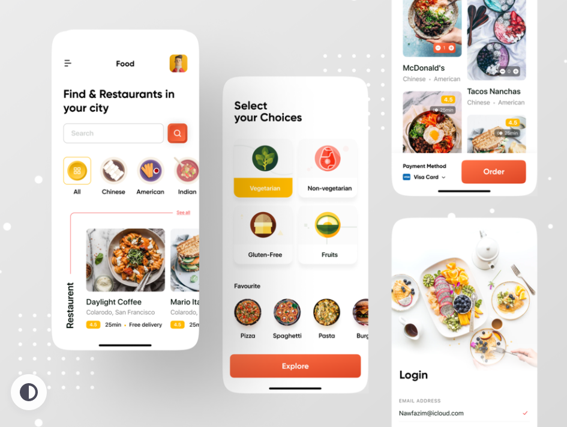
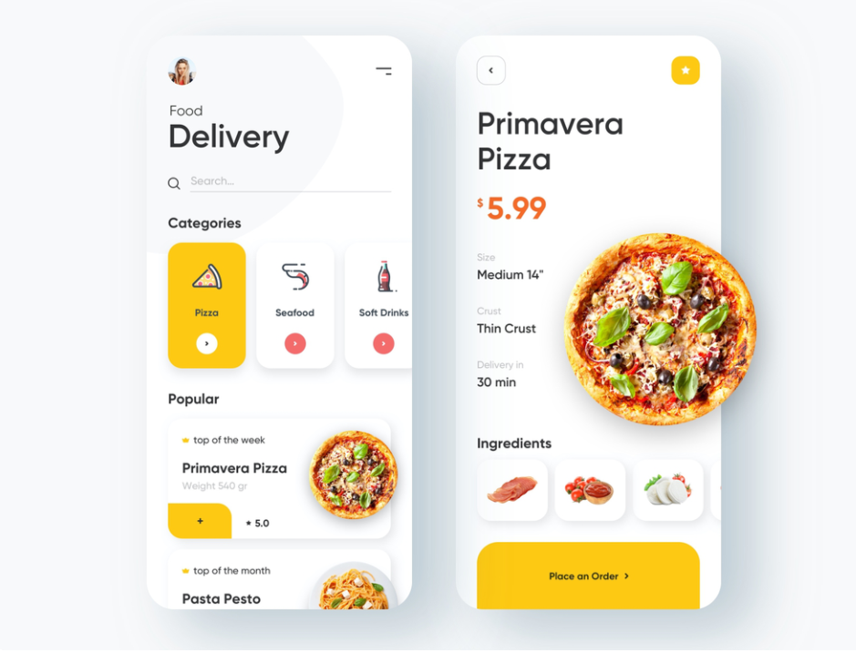

### [ 레시피 추천 서비스 ]

### 서비스 기획

#### 디자인 관련 URL

- UI 템플릿 사이트
    - [https://uiplace.com/](https://uiplace.com/)
    - [https://dribbble.com/](https://dribbble.com/)
    - [https://www.behance.net/search/moodboards](https://www.behance.net/search/moodboards)

- 색상 조합 사이트
    - [https://palettable.io/](https://palettable.io/)

#### 디자인 참고

## 기능 명세

### 1. 남은 음식 기반 레시피 추천 기능

⇒ 남은 음식들을 선택하면 취향에 기반하여 레시피를 추천해준다

#### 1) 기존 데이터

- 만개의 레시피 크롤링 (재료, 요리 순서)
- 해먹남녀 크롤링
- 공공데이터포털 - 한식 레시피 데이터

#### 2) 사용자  데이터

- 취향분석
    - 한식 / 일식 / 중식 / 양식
    - 맵기
    - 채식주의
    - 알러지 여부 / 트라우마

- 관심목록(좋아요) 기반
    - 좋아요를 클릭한 레시피 분석

- 조회한 태그 기반
    - 조회한 레시피 태그 목록 분석